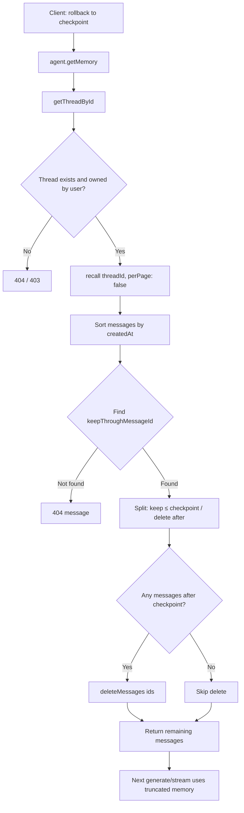
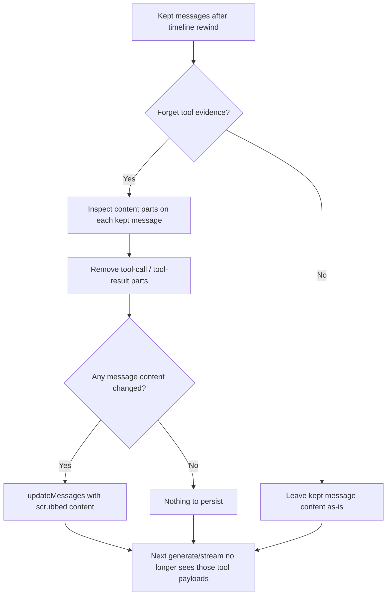

# Rolling back agent AI

To fully roll back actions taken by an AI agent, we need a dual strategy:

1. **Roll back AI agent internal state** (rewinding the agent's memory / conversation history).
2. **Execute compensating operations** (reversing external real-world actions like database writes or file creations).

Internal rollback alone is not enough when the agent has already changed the outside world. Those side effects need their own reverse steps.

## Thoughts: why two strategies

An agent lives in two places at once:

- **Inside its head** — what it remembers from the conversation, including what tools returned.
- **Outside in the world** — what those tools actually changed (templates, files, records, and so on).

Users experience failure when we only fix one of those. Rewinding chat without undoing a bad save leaves the product wrong. Undoing a save without rewinding chat leaves the agent believing the bad action still happened, so it may double-apply or refuse to “fix” what it thinks is already done.

So rollback is a **pair**: memory first (or together), then compensate external effects.

## Roll back AI agent internal state

For our agents, the meaningful internal state is the **conversation memory for a thread**: the ordered history of user and assistant turns that the model will see on the next request.

Internal rollback covers two separate concerns:

1. **Chat messages after the checkpoint** — rewind the conversation timeline.
2. **Tool results in kept messages** — forget tool evidence that still sits on the kept timeline.

These are related but not the same step. Timeline rewind deletes later turns. Tool-result rollback edits what remains.

### Chat messages after the checkpoint

**Why.** The next agent turn is shaped by what remains in conversation memory. Messages after the user’s chosen point are the “future” they want to undo: later user prompts, assistant replies, and any tool use embedded in those turns. If those stay, the agent still believes that work happened and will continue from it — even if the product was restored elsewhere. Deleting that future is how we make the agent’s memory match the user’s intent to go back.

**How.** The user picks a checkpoint message — the last turn they still want to keep. Everything newer than that point is removed from the thread’s memory. The checkpoint itself stays. What remains is an earlier, continuous history the model can resume from, as if the discarded turns never entered working memory.

**Workflow.**

### Tool results in kept messages

**Why.** Rewinding the timeline removes later turns, but kept messages can still carry tool calls and tool results from work the user no longer wants as settled fact. Those payloads can be large and authoritative (for example full document content). If they stay, the agent may treat them as truth, refuse to redo work, or re-apply changes based on stale tool output — even though the “future” chat is gone.

**How.** After (or as part of) keeping the checkpoint timeline, strip tool-related parts from the content of messages that remain. Plain chat text can stay; tool evidence is removed so the next turn cannot lean on those outputs. Optionally limit scrubbing to named tools when only some tool evidence should be forgotten.

**Workflow.**

### What this does not mean

Internal rollback is **not**:

- Undoing configuration, files, or other system writes.
- Restoring an earlier product revision by itself.
- Erasing the conversation thread’s identity (you can keep the same thread and continue from the earlier point).

Those belong to compensating operations, or to product-specific restore flows.

## Compensating operations (external state)

Once memory matches the point the user wants, reverse what tools already did in the real system: restore a prior version, delete a created artifact, or apply an inverse update.

Those steps depend on the domain. A PDF template change, a form schema change, and a file upload each need a different reverse story. Memory rollback does not invent those stories for you.

## Summary

**Timeline rollback removes chat after the checkpoint. Tool-result rollback forgets tool evidence on what remains. Compensating operations reverse what the agent already changed outside. You usually need all of these for a complete undo.**
